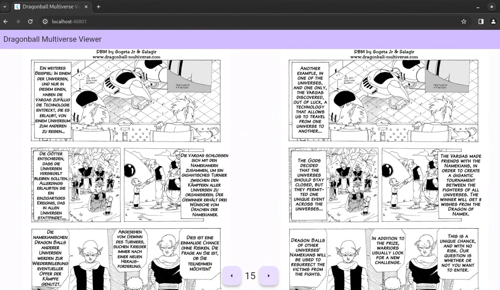

# Dragonball Multiverse Viewer



## Objective

[Dragonball Multiverse](https://www.dragonball-multiverse.com) is a non-official fiction sequel to the legendary Dragonball manga, made by fans for fans and available in multiple languages. As I want to learn German, I find it a good idea to be able to view the same page in 2 different languages (German and English) side by side. Therefore, I created this app to boost up my German learning.

## Run locally

### Web

```bash
$ flutter run -d chrome --web-browser-flag "--disable-web-security"
```

As the server is not owned by me, I can't directly configure the CORS settings to allow my request origin. Therefore, `--web-browser-flag "--disable-web-security"` is needed, leading to the consequence that this may not be released and published as a website. However, for my personal German learning, it's not an issue.

### Linux

```bash
$ flutter run -d linux
```

Weirdly, the same requirement for web doesn't exist in native apps so we don't need to worry about CORS.
